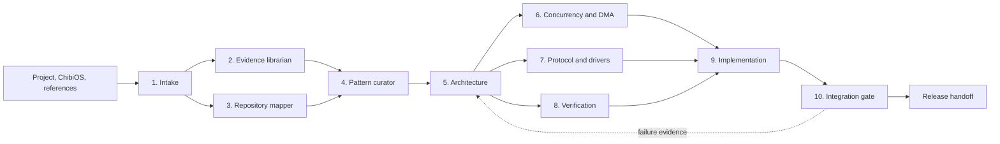

# Serori ChibiOS Plugin

Serori (セロリ) is a provider-neutral agent network for ChibiOS firmware work.
It converts a project, its target-specific ChibiOS checkout, and embedded
references into evidence-backed design, implementation, and verification
artifacts. The same artifact model is intended for ChatGPT/Codex and Claude
Code adapters.

## Operating contract

Every agent reads existing artifacts and produces an evidence-linked result:

```yaml
artifact:
  id: descriptive-unique-id
  schema_version: 1
  project: project-name
  created_by: serori-agent-name
  inputs: []
  assumptions: []
  decisions: []
  risks: []
  evidence: []
  status: draft # draft | reviewed | accepted | rejected
```

Evidence must identify a repository path and line, a ChibiOS version/commit and
API location, or a reproducible test result. An unverified conclusion is an
assumption, not a finding.

## Artifact Git policy

Serori keeps artifacts flat under the repository's `artifacts/` directory.
Git is the version-control system for those files and should record artifact
changes in the same commit or review as the source, configuration, and tests
that produced them.

Accepted artifacts must be treated as immutable. If an artifact changes, write
a new artifact with a new content-derived ID and reference the previous record
using `inputs`; use `supersedes` when it replaces an earlier artifact. Do not
silently overwrite an accepted artifact. Git history remains authoritative for
authorship, review, timestamps, branching, and rollback, while the artifact ID
is only a content identity.

Use only the forward `supersedes` link on the replacement. Retain
superseded artifacts in Git for auditability and reproducibility, but exclude
them from the active artifact set when selecting the latest accepted result.

Retained artifacts should contain enough evidence to reproduce the result,
including relevant file hashes, commands or test results, and the exact
ChibiOS revision. Intermediate session outputs may remain uncommitted or be
removed when no longer useful; canonical reviewed or accepted artifacts should
be committed.

## Canonical inputs and outputs

### Inputs

- PLAY-embedded workflow and project conventions;
- ChibiOS documentation and version-specific API contracts;
- ChibiOS coding examples;
- the user's project, build configuration, and tests; and
- embedded design references, including *Embedded Design Patterns* by Elecia
  White, used as guidance rather than copied source text.

### Outputs

- provider-neutral structured skills for ChatGPT/Codex and Claude Code;
- deterministic scripts for repeated inspection, testing, and reporting;
- reusable patterns for buffering, DMA, ISR boundaries, and communication
  protocols; and
- implementation patches with tests, assumptions, evidence, and validation
  status.

## Plugin contents

```text
serori/
  skills/
    embedded-intake/SKILL.md
    chibios-concurrency/SKILL.md
    embedded-patterns/SKILL.md
    dma-ownership/SKILL.md
    protocol-drivers/SKILL.md
    firmware-verification/SKILL.md
  references/
    patterns/*.md
    chibios/<version>/*.md
  scripts/
    serori-intake
    serori-map
    serori-evidence
    serori-check-ownership
    serori-test
    serori-review
  schemas/
  adapters/
    chatgpt/
    claude-code/
```

Scripts emit machine-readable JSON/YAML as well as a concise human-readable
result, return non-zero for gate failures, and do not require an LLM for
deterministic checks.

## Network



Agents communicate through artifacts, not unstructured handoffs. An
implementation agent may make local changes required by an accepted design, but
must not silently alter a platform contract or ownership decision.

## Agent catalog

### 1. Intake and scope agent

**Purpose:** establish a safe, bounded task before code is examined in depth.

**Inputs:** user goal, project tree, board/MCU, ChibiOS checkout, build and
configuration files.

**Produces:** `project_context.yaml` with target, ChibiOS identity, memory and
latency budget, execution contexts, required protocols, acceptance criteria,
and out-of-scope items.

**Must ask or block on:** unknown MCU/board, unknown ChibiOS source revision,
or a requested change that has no failure/acceptance policy.

### 2. Version and evidence librarian

**Purpose:** prevent recommendations based on the wrong ChibiOS API contract.

**Inputs:** `project_context.yaml`, `libs/ChibiOS`, ChibiOS documentation,
release notes, and project API use sites.

**Produces:** `evidence/index.yaml` and claim records classified as confirmed,
disproved, version-dependent, or assumption.

**ChibiOS rules it enforces:** record the Git commit or release identity; do not
rely only on a stale version header; verify API suffix/context semantics;
verify ADC depth and callback contracts against the actual checkout.

### 3. Repository mapper

**Purpose:** build the dependency, build, and runtime map that constrains every
later decision.

**Inputs:** source tree, Makefiles, `mcuconf.h`, `halconf.h`, `chconf.h`,
ChibiOS board/startup files, and tests.

**Produces:** `repo_map.yaml`, build graph, runtime graph, source ownership
map, and a list of reproducible build blockers.

**Checks:** ChibiOS path resolution, selected board/startup/linker files,
enabled peripheral drivers, worker-thread creation sites, and generated versus
hand-authored configuration files.

### 4. Pattern curator

**Purpose:** select portable embedded patterns and reject unsafe pattern
matches.

**Inputs:** evidence index, repository map, approved design constraints, and
embedded design references.

**Produces:** pattern cards with intent, applicability, interface, invariants,
ownership table, failure modes, test vectors, and ChibiOS adaptation notes.

**Initial card set:**

- bounded SPSC/MPSC queues;
- ISR-to-thread handoff;
- DMA ping-pong and buffer-pool ownership;
- copy-on-enqueue versus zero-copy decision;
- UART framing and backpressure;
- SPI transaction ownership;
- I2C timeout and bus recovery;
- CAN receive queue/release;
- ADC half/full-buffer pipeline;
- logger start, drain, stop, and restart lifecycle.

### 5. Design and architecture agent

**Purpose:** turn evidence and patterns into explicit interfaces and state
transitions.

**Inputs:** approved pattern cards, constraints, and relevant evidence.

**Produces:** an architecture decision record, interface proposal, ownership
table, scheduling model, error policy, and lifecycle state machine.

**Required decisions:** producer/consumer contexts, payload owner before and
after enqueue, queue-full behavior, callback/release behavior, backend failure,
stop/drain policy, and restart admission criteria.

### 6. ChibiOS concurrency and DMA reviewer

**Purpose:** independently try to disprove synchronization, context, and data
lifetime claims before implementation.

**Inputs:** architecture record, ChibiOS headers/source, ISR callbacks,
thread entry points, queue implementation, and DMA configuration.

**Produces:** concurrency review with severity, proof, invariants, and required
tests.

**ChibiOS-specific rules:**

- No API suffix means thread context; `X` is any context; `S` requires system
  lock; `I` requires interrupt/system-locked context.
- ADC completion callbacks are ISR-context work; they must not call thread-only
  APIs, block, allocate, format output, or use a thread mutex.
- ISR wakeups use the appropriate `I`-class primitive while system-locked; a
  thread caller must use the thread-context primitive.
- DMA storage must remain valid and immutable until the consumer releases it,
  or the completed data must be copied/ownership-transferred before reuse.

### 7. Protocol and driver specialist

**Purpose:** review protocol state machines at their hardware/RTOS boundaries.

**Inputs:** architecture record, driver configuration, channel code, relevant
ChibiOS examples, and backend implementation.

**Produces:** per-protocol state machine, ownership/retry model, timeout and
backpressure policy, and lifecycle requirements.

**Coverage:**

| Protocol/path | Required questions |
|---|---|
| ADC/DMA | Who owns each half-buffer? What happens under consumer lag or DMA error? |
| CAN | Can an RX buffer be reused only after acceptance/release? What happens on queue rejection or reset? |
| UART/serial | Where is blocking allowed? What are write timeout, failure, and degraded-mode policies? |
| SPI | Who owns chip select, transfer buffer, completion callback, and retry? |
| I2C | What is the timeout, reset, arbitration-loss, and bus-recovery policy? |

### 8. Test and verification designer

**Purpose:** define tests that disprove unsafe assumptions before integration.

**Inputs:** architecture record, concurrency review, protocol artifacts, and
existing test/build targets.

**Produces:** verification matrix, test fixtures, instrumentation requirements,
and release gates.

**Levels:** strict host unit tests; ASan/UBSan and stress tests; mocked ISR
interleavings; ChibiOS target compile/link/size checks; HIL tests on the selected
board; soak, saturation, stop/restart, and fault-injection tests.

### 9. Implementation worker

**Purpose:** make the smallest accepted change and preserve the approved
contract.

**Inputs:** accepted design record, test plan, and review gates.

**Produces:** focused patch, tests, changelog-quality implementation notes, and
evidence of checks run.

**Restrictions:** no unapproved synchronization primitive, payload ownership
change, public API semantic change, or ChibiOS version migration. Source and
generated configuration changes must follow the bundled ChibiOS repository
guidance.

### 10. Validation and integration gate

**Purpose:** decide pass, conditional pass, or failure using adversarial checks.

**Inputs:** implementation patch, all review artifacts, build/test outputs, and
the evidence index.

**Produces:** gate report with completed criteria, failed criteria, blockers,
and release/PR handoff decision.

**Minimum gate checks:** diff scope, clean build, host tests, sanitizer results,
context/API audit for ISR paths, queue and ownership invariants, generated-file
hygiene, configuration variant checks, and explicit reporting of unavailable
hardware or dependencies as `BLOCKED` rather than `PASS`.

## Cross-agent invariants

1. Every producer has one permitted thread or ISR enqueue path.
2. Queue metadata is protected by one documented synchronization model.
3. An accepted payload is valid and unchanged until write completion/release.
4. Rejection returns ownership to the producer immediately.
5. Queue-full, backend failure, timeout, and shutdown loss are observable.
6. ISR work is bounded and does not use thread-only APIs.
7. Stop quiesces producers before draining or discarding queued work.
8. Restart creates at most one worker/acquisition path per channel.
9. ChibiOS APIs match the selected checkout's context and lifecycle contract.
10. No agent upgrades an assumption into a fact without evidence.

## Standard workflow

1. Run intake, librarian, and repository mapper in parallel after scope is
   known.
2. Curate patterns and produce one architecture record.
3. Run concurrency/DMA, protocol, and verification reviews in parallel.
4. Require accepted ownership, context, overflow, and lifecycle decisions.
5. Implement one bounded change with its tests.
6. Run the integration gate; route failures back to architecture with evidence.
7. Package accepted skills, scripts, pattern cards, and the validation report
   for the ChatGPT/Codex and Claude Code adapters.

## Current any-logger evidence baseline

- ChibiOS is available at `libs/ChibiOS`, currently `master` commit
  `fd2e59c34878b1ef93ef5358f11fb5cc830027ff`.
- The STM32F303RE/Nucleo target, ADC/DMA, CAN, and serial paths are present.
- The principal risks remain queue synchronization, ISR safety, DMA buffer
  ownership, queue-full handling, CAN recovery, and stop/restart lifecycle.
- The verified ChibiOS ADC depth contract treats depth as sample-matrix rows;
  transfer geometry must therefore be judged with `num_channels * depth`.

## Provider adapters

The canonical content is provider-neutral. ChatGPT/Codex exposes agents as
`SKILL.md` packages with optional `agents/openai.yaml` metadata and scripts.
Claude Code consumes equivalent instruction files, commands, scripts, and the
same schemas/references. Provider adapters must not duplicate or reinterpret
the embedded pattern cards.

## Builder knowledge incorporated from PLAY Embedded

The provider-neutral implementation now lives under `serori/`. Its references consolidate the
read-only builder fanouts over the PLAY Embedded inputs covering ChibiOS project anatomy,
configuration layering, initialization, static and dynamic threads, scheduler quantum and tickless
timing, critical zones, mutex inheritance, parametric thread arguments, argument lifetime, ELF/symbol
debugging, optimization-aware validation, stack watermarking, pointer bounds, `memcpy`, pools,
allocation failure, and fragmentation.

These sources are conceptual and version-qualified. The local checkout is authoritative for exact
symbols and semantics: ChibiOS 21.11 release line, HAL component 9.1.0, and the local revision
`fd2e59c34878b1ef93ef5358f11fb5cc830027ff`. Article-era claims such as trace-mask values,
thread-state names, scheduling behavior, and API signatures must be classified as
`version-dependent` until verified against that checkout.

The generated package is available at:

```text
serori/
  skills/                    # 11 provider-neutral agent skills
  references/                # PLAY Embedded, ChibiOS 21.11/HAL 9.1.0, and pattern cards
  schemas/                   # artifact/task contracts
  scripts/                   # intake, map, evidence, review, and safety stubs
  adapters/                  # ChatGPT/Codex and Claude Code manifests
```

Implementation and integration are approval-gated. The ownership checker and test runner return
`BLOCKED` until explicit rules/test profiles are supplied; they do not claim that unconfigured
static analysis or tests prove firmware safety.
