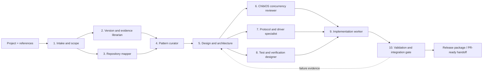

# Serori Agent Network Plan

セロリ — an AI plugin for embedded ChibiOS development

## 1. Mission

Serori turns embedded-firmware references and a user's project into dependable,
reviewable implementation work for ChatGPT and Claude Code.

The first product should not be a single giant agent. It should be a small
network of specialized workers sharing structured artifacts, evidence, and
validation results.

## 2. Inputs and outputs

### Inputs

- PLAY-embedded material (workflow and project conventions).
- ChibiOS documentation and version-specific API contracts.
- ChibiOS coding examples.
- The user's repository, build files, tests, and target configuration.
- *Embedded Design Patterns* by Elecia White, used as design guidance rather
  than as a source of copied text.

### Outputs

- Provider-neutral skills that work as `SKILL.md` packages in ChatGPT/Codex and
  as instruction/reference packages in Claude Code.
- Deterministic scripts for recurring actions: inspect, scaffold, test, lint,
  trace ownership, and generate review reports.
- Reusable embedded patterns for buffering, DMA, ISR boundaries, and common
  communication protocols.
- Implementation patches with tests, assumptions, evidence, and validation
  status.

## 3. Agent network

The network is a directed workflow. Agents communicate through artifacts, not
long conversational handoffs.



### Agent responsibilities

| Agent | Owns | Must produce |
|---|---|---|
| Intake and scope | Goals, constraints, target MCU/board, ChibiOS version, acceptance criteria | `project_context.yaml` |
| Version and evidence librarian | Source provenance, version matching, quotations/paraphrases, unresolved gaps | `evidence/index.yaml` and evidence records |
| Repository mapper | Build graph, public APIs, platform seams, tests, risks | `repo_map.yaml`, dependency map, risk register |
| Pattern curator | Portable patterns and anti-patterns from the references | Pattern cards with applicability and failure modes |
| Design and architecture | Interfaces, ownership, lifecycle, scheduling, error policy | Design record and decision log |
| ChibiOS concurrency reviewer | ISR/thread boundaries, locks, events, DMA cache/ownership, priority issues | Concurrency review with severity and proof |
| Protocol and driver specialist | UART, SPI, I2C, CAN, ADC, DMA and framing choices | Driver/protocol design and state-machine notes |
| Test and verification designer | Host tests, HIL tests, assertions, sanitizers, timing/fault cases | Verification matrix and test plan |
| Implementation worker | Minimal code changes following approved design | Patch plus test additions |
| Validation and integration gate | Build, tests, static checks, diff scope, evidence completeness | Gate report: pass, conditional, or fail |

The implementation worker is deliberately downstream of the reviewers. It may
make local fixes required to pass the gate, but it must not silently change a
design decision or platform contract.

## 4. Shared artifact contract

Every agent reads the current artifact set and writes a new or updated artifact
with these fields:

```yaml
artifact:
  id: unique-name
  schema_version: 1
  project: any-logger
  created_by: agent-name
  inputs: [artifact-id]
  assumptions: []
  decisions: []
  risks: []
  evidence: []
  status: draft # draft | reviewed | accepted | rejected
```

Evidence entries should point to a repository path and line, a versioned
documentation location, or a test result. Claims without evidence are labelled
as assumptions, not facts.

## 5. Network rules

1. **Scope before code.** Intake must identify target MCU/board, ChibiOS
   version, execution contexts, memory constraints, and required protocols.
2. **Version-match APIs.** The librarian blocks recommendations that depend on
   an unverified ChibiOS contract.
3. **Ownership is explicit.** Every buffer, descriptor, DMA region, callback,
   and queue entry has an owner and a transfer/release rule.
4. **ISR work is bounded.** ISR agents may capture, acknowledge, enqueue, or
   signal; formatting, blocking, allocation, and storage I/O belong to a thread
   unless explicitly justified.
5. **Failures are observable.** Queue-full, timeout, protocol, backend, and
   lifecycle failures need a return status, counter, event, or documented loss
   policy.
6. **Design review precedes implementation.** Architecture and concurrency
   artifacts must be accepted before code generation.
7. **The gate is adversarial.** Validation attempts to disprove safety and
   ownership claims with boundary, race, restart, overflow, and fault tests.

## 6. Initial pattern catalog

Start with patterns that are directly relevant to this repository:

- SPSC ring buffer with an explicit capacity and initialization contract.
- MPSC-to-single-consumer queue using a critical section or RTOS primitive.
- ISR-to-thread event handoff with bounded descriptors.
- DMA ping-pong buffers with ownership transfer and completion sequencing.
- DMA buffer pool for payloads that outlive an interrupt callback.
- Zero-copy versus copy-on-enqueue decision record.
- UART framed transport with timeout and resynchronization.
- SPI transaction queue with chip-select ownership.
- I2C transaction state machine with timeout and bus recovery.
- CAN receive mailbox/ring with backpressure and drop accounting.
- ADC sampling pipeline with half/full transfer events.
- Logger lifecycle: configure, start, running, draining, stopped, faulted.

Each pattern card should include: intent, context constraints, interface,
invariants, ownership table, failure modes, test vectors, and ChibiOS-specific
adaptation notes.

## 7. Scripts for common actions

The first script bundle should be small and deterministic:

```text
scripts/
  serori-intake        # collect project facts and write project_context.yaml
  serori-map           # inventory source/build/tests and emit repo_map.yaml
  serori-evidence      # validate evidence links and unresolved claims
  serori-check-ownership # report pointer/DMA/queue ownership gaps
  serori-test          # run host tests, sanitizers, and configured ChibiOS checks
  serori-review        # generate a structured risk/review report
```

Scripts should emit machine-readable JSON/YAML plus human-readable output,
return non-zero on gate failures, and avoid requiring an LLM for deterministic
checks.

## 8. Provider-neutral packaging

Use one canonical content model and thin adapters:

```text
serori/
  skills/
    embedded-intake/SKILL.md
    chibios-concurrency/SKILL.md
    embedded-patterns/SKILL.md
    dma-ownership/SKILL.md
    protocol-drivers/SKILL.md
    firmware-verification/SKILL.md
  references/
    patterns/*.md
    chibios/<version>/*.md
  scripts/
  schemas/
  adapters/
    chatgpt/
    claude-code/
```

ChatGPT/Codex uses `SKILL.md`, `agents/openai.yaml`, and executable scripts.
Claude Code receives the same skills and references through its project
instruction/command mechanism. No provider-specific behavior belongs in the
pattern cards or schemas.

## 9. MVP sequence

### M0 — establish the contract

- Freeze the artifact schema and agent handoff rules.
- Build the intake and repository-map artifacts for `any-logger`.
- Record ChibiOS version and external dependency assumptions.

### M1 — prove the network on any-logger

- Run the concurrency, DMA ownership, queue-loss, and lifecycle agents over the
  existing project.
- Produce a review report and verification matrix.
- Add only the scripts needed to reproduce the evidence.

### M2 — implement the first pattern pack

- Ring buffer, ISR-to-thread handoff, DMA ping-pong, UART, CAN, and logger
  lifecycle cards.
- Add host-test fixtures for the invariant-heavy portions.

### M3 — implement one end-to-end change

- Select one bounded improvement, preferably an ownership-safe asynchronous
  enqueue path.
- Require design acceptance, patch generation, host tests, and a validation
  gate.

### M4 — package for both providers

- Add the ChatGPT/Codex skill metadata and Claude Code adapter.
- Run the same task through both adapters and compare artifact quality.

## 10. Definition of done for the first goal

The planning goal is complete when:

- The agent roles and dependency graph are stable.
- Every handoff has a schema and evidence policy.
- The MVP sequence identifies one demonstrable end-to-end task.
- `any-logger` is the reference project and its known embedded risks are
  represented as acceptance tests.
- Provider-specific packaging is separated from canonical embedded knowledge.

The next implementation step is M0: create the canonical `serori/` scaffold,
schemas, and the first two agents (`embedded-intake` and `repository-map`).
