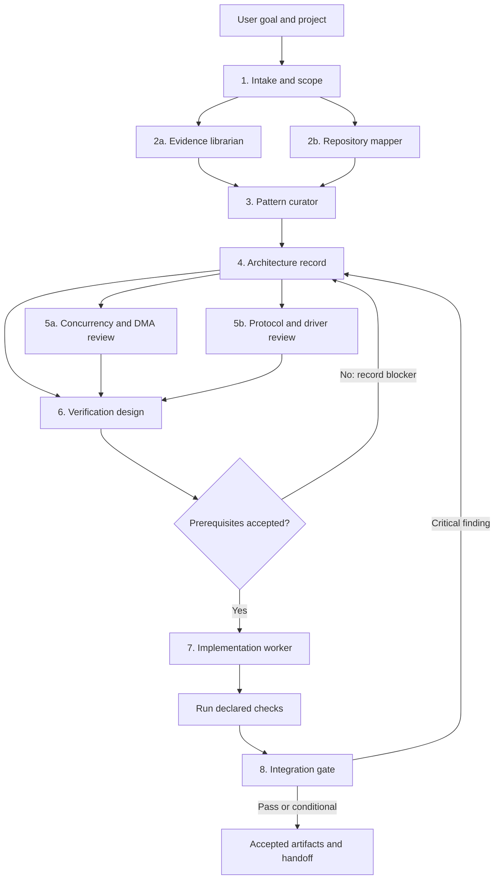

# Serori provider-neutral package

This package contains the canonical Serori skills, references, schemas, and deterministic scripts.
ChatGPT/Codex and Claude Code adapters must consume these artifacts without changing their semantics.

## Safety boundary

The default workflow is read-only analysis. Scripts never mutate source, perform Git mutation,
install dependencies, flash hardware, or attach to a debugger. Implementation requires an accepted
architecture, concurrency/ownership review, and verification matrix.

## Workflow selection and execution

The plugin selects a workflow from the user's requested outcome, the current
artifact set, and the repository facts discovered during intake and mapping.
The agent must state the selected scope and run only the stages applicable to
that scope. When the request is ambiguous, use the default firmware-analysis
workflow and stop at the first missing decision or prerequisite.

### Default firmware workflow



Run these stages in order:

1. **Intake** — establish goal, board/MCU, toolchain, ChibiOS revision,
   constraints, protocols, acceptance criteria, and out-of-scope work.
2. **Evidence and repository map** — verify versioned claims and inventory
   source, configuration, build inputs, runtime contexts, ownership candidates,
   and tests. These stages may run in parallel after scope is known.
3. **Pattern selection** — select applicable cards from
   `references/patterns.md`; record their invariants, risks, evidence, and
   required tests. Do not treat a card as proof or as an implementation.
4. **Architecture** — turn accepted context, map, evidence, and patterns into
   bounded interfaces, state machines, ownership transfers, failure policies,
   and decisions. Architecture remains `draft` until reviewed.
5. **Specialist reviews** — run only the reviews indicated by the repository
   and design: `chibios-concurrency` for contexts and synchronization,
   `dma-ownership` for DMA buffers, and `protocol-drivers` for ADC/DMA, CAN,
   UART, SPI, or I2C state machines. These reviews may run in parallel.
6. **Verification** — translate every accepted invariant into host, sanitizer,
   static, target, HIL, debug-instrumentation, or soak tests as applicable.
7. **Implementation** — run `implementation-worker` only when the accepted
   architecture, required specialist reviews, verification matrix, and write
   scope are present. Apply the smallest approved change and record its diff
   and test results.
8. **Integration gate** — run `integration-gate` after deterministic checks.
   Critical findings, stale evidence, unresolved ownership, illegal context
   calls, failed tests, unresolved build inputs, or forbidden writes fail the
   gate.

### Request-to-stage routing

- A request to understand or bound a problem starts at **intake**.
- A request to inventory a repository starts at **repository-map**, but it must
  use a reviewed or accepted context when one is required by that skill.
- A request to validate a claim or API starts at **evidence-librarian** and
  records the exact source or ChibiOS revision.
- A request to choose a design starts at **patterns**, then **architecture**;
  it must not jump directly from prose to source changes.
- A request involving ISR, threads, locks, queues, or scheduling includes
  **chibios-concurrency**.
- A request involving DMA, buffers, callbacks, or descriptor lifetime includes
  **dma-ownership**.
- A request involving ADC/DMA, CAN, UART/Serial, SPI, or I2C includes
  **protocol-drivers**.
- A request to test or prove behavior includes **firmware-verification**.
- A request to modify source includes the complete prerequisite chain through
  **implementation-worker**, followed by **integration-gate**.
- A request only for review may stop after the relevant specialist reviews or
  run the integration gate if a complete artifact set exists.

### Routing and safety rules

The agent reads the latest accepted, non-superseded artifacts before selecting
the next stage. A missing, rejected, stale, or unresolved prerequisite blocks
downstream work; it is not silently recreated from memory. Specialist stages
are conditional, but any detected relevant construct must be covered or
explicitly recorded as unresolved.

The default permission is read-only. Source edits require an explicit user
request and the implementation prerequisites above. Scripts may inspect and
emit artifacts, but must not mutate source, Git state, dependencies, hardware,
or debugger state. Every stage emits an artifact with inputs, evidence,
decisions, risks, and status so the next stage can determine what is allowed.

### Process roles and contracts

| Stage | Responsibility | Primary output |
|---|---|---|
| Intake and scope | Bound the task and identify target, revision, constraints, protocols, and acceptance criteria. | Project context |
| Evidence librarian | Classify claims and verify paths, APIs, hashes, tests, and ChibiOS provenance. | Evidence index and claim records |
| Repository mapper | Map build inputs, runtime contexts, ownership candidates, and blockers. | Repository map |
| Pattern curator | Select applicable patterns and record invariants, ownership, failure modes, and tests. | Pattern selections |
| Architecture | Define interfaces, state transitions, ownership, scheduling, failure, and lifecycle decisions. | Architecture decision record |
| Concurrency/DMA reviewer | Attempt to disprove context, synchronization, and data-lifetime claims. | Review findings and required tests |
| Protocol specialist | Review protocol state machines, retries, timeouts, backpressure, ownership, and recovery. | Protocol review artifact |
| Verification designer | Turn invariants into host, sanitizer, target, HIL, soak, or fault tests. | Verification matrix |
| Implementation worker | Apply the smallest approved source change within the allowed write set. | Patch, tests, and implementation evidence |
| Integration gate | Perform adversarial checks and decide pass, conditional, or fail. | Gate report and handoff decision |

Agents communicate through artifacts, not informal handoffs. Every artifact
must identify its inputs, assumptions, decisions, risks, evidence, and status.
Claims without evidence remain assumptions. The exact ChibiOS Git revision or
release identity must be recorded; a stale version header or article alone is
not sufficient.

The shared safety invariants are:

1. Every producer has one permitted thread or ISR enqueue path.
2. Queue metadata has one documented synchronization model.
3. Accepted payloads remain valid and unchanged until completion or release.
4. Rejected work returns ownership to the producer immediately.
5. Queue-full, backend failure, timeout, and shutdown loss are observable.
6. ISR work is bounded and does not use thread-only APIs.
7. Stop quiesces producers before draining or discarding queued work.
8. Restart creates at most one worker or acquisition path per channel.
9. ChibiOS APIs match the selected checkout's context and lifecycle contract.
10. No assumption is promoted to a fact without evidence.

### Canonical inputs and outputs

Serori consumes the user goal, project tree, board/MCU and toolchain details,
the target-specific ChibiOS checkout, build and configuration files, existing
tests, versioned ChibiOS references, and approved embedded design references.

It produces provider-neutral structured artifacts, deterministic inspection and
gate results, reusable pattern cards, implementation patches with tests, and
evidence-backed validation reports. ChatGPT/Codex and Claude Code adapters must
consume these artifacts without changing their semantics.

### Artifact and handoff contract

Artifacts are the only cross-stage handoff. Each artifact uses
`schemas/artifact.schema.yaml` and contains an envelope with:

```yaml
artifact:
  id: content-derived-id
  schema_version: 1
  project: project-name
  created_by: serori-stage
  inputs: [artifact-id]
  assumptions: []
  decisions: []
  risks: []
  evidence: []
  status: draft # draft | reviewed | accepted | rejected
data: {}
```

Artifacts remain flat under the repository's `artifacts/` directory. Git is
the system of record; artifact changes should be reviewed and committed with
the source, configuration, and tests they describe. Accepted artifacts are
immutable. A revision creates a new content-derived ID, references earlier
artifacts through `inputs`, and uses `supersedes` when replacing one.

Superseded artifacts remain in Git for auditability but are excluded from the
active set. Optional `milestone` and `session_id` metadata may group artifacts
without creating subdirectories.

Evidence must point to a repository path and line, a versioned documentation
location, a source/configuration hash, a test result, or an exact ChibiOS
revision. If a claim cannot be verified, classify it as an assumption or
unresolved finding.

### Gate behavior

The integration gate returns `pass`, `conditional`, or `fail`. It must fail on
critical findings, stale or missing evidence, unresolved ownership, illegal
context/API calls, failed declared tests, unresolved build inputs, or forbidden
writes. Missing hardware or dependencies are reported as `BLOCKED`, never as a
passing result. Gate failures route evidence back to architecture or the
relevant specialist review; they do not get waived by prose.

## Skill map

- `embedded-intake`: establish target, revision, constraints, and acceptance criteria.
- `repository-map`: map files, build/configuration, runtime, and ownership candidates.
- `evidence-librarian`: validate claims and versioned provenance.
- `embedded-patterns`: select patterns and record invariants/failure modes.
- `architecture-design`: turn evidence into bounded interfaces and lifecycle decisions.
- `chibios-concurrency`: audit contexts, scheduler, synchronization, and API suffixes.
- `dma-ownership`: prove buffer ownership across DMA and consumers.
- `protocol-drivers`: review ADC/DMA, CAN, UART, SPI, and I2C state machines.
- `firmware-verification`: produce host, sanitizer, target, HIL, and soak tests.
- `implementation-worker`: apply only accepted designs, with explicit approval.
- `integration-gate`: perform the final adversarial gate; never waive deterministic failures.
